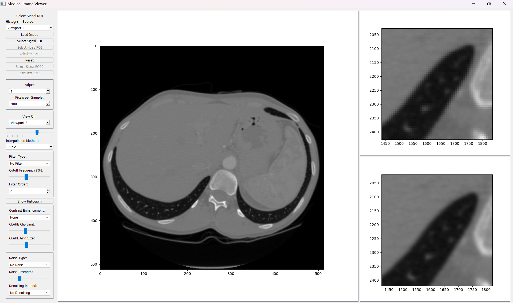
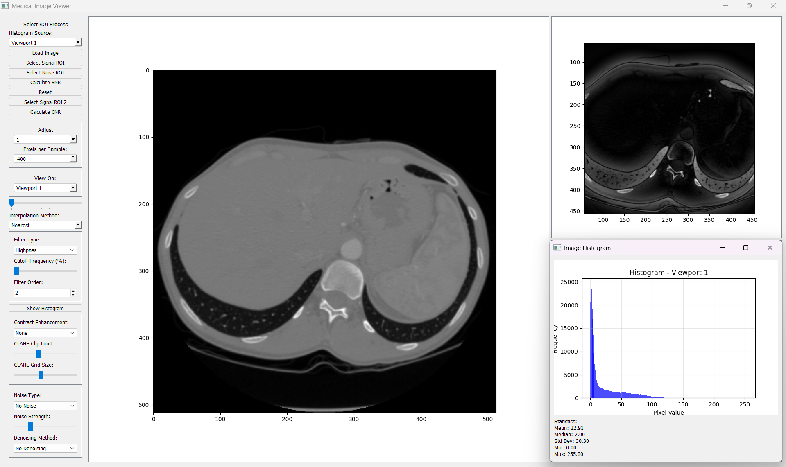
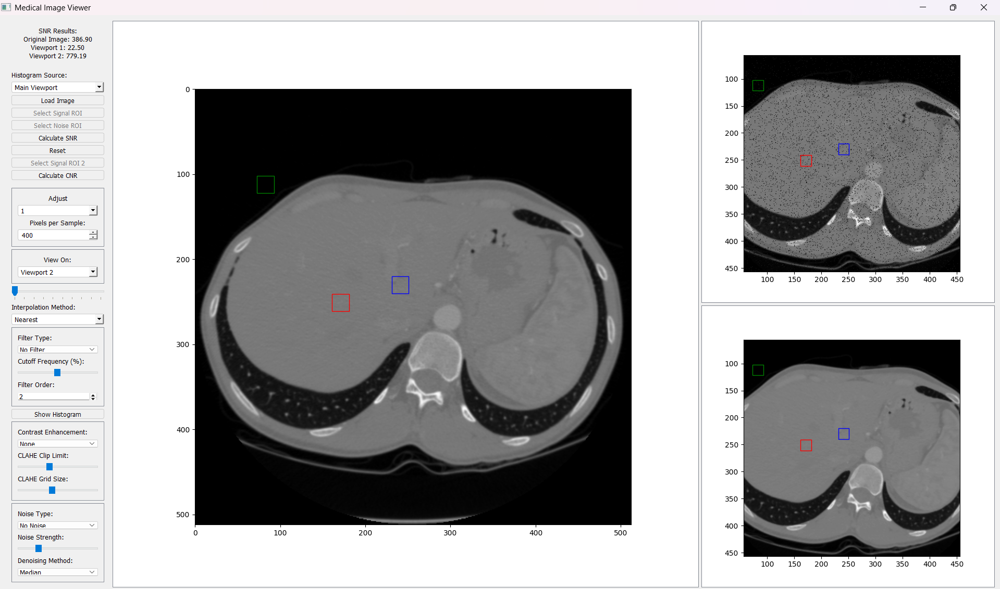

# MediPixel

A Python-based GUI application for medical image visualization, processing, and analysis. This tool is designed for working with medical images in formats like DICOM and standard image formats.

---

## **Features**
- **Image Loading**: Load and display DICOM and other image formats (e.g., PNG, JPEG).
- **Noise Addition**: Add Gaussian, Salt & Pepper, or Poisson noise to the images.
- **Denoising**: Apply noise reduction methods such as Median, Bilateral, and Non-local Means filters.
- **Contrast Enhancement**: Improve image quality using:
  - Histogram Equalization
  - CLAHE (Contrast Limited Adaptive Histogram Equalization)
  - Adaptive Gamma Correction
- **ROI Selection**: Select Regions of Interest (ROIs) for:
  - Signal-to-Noise Ratio (SNR) calculation
  - Contrast-to-Noise Ratio (CNR) calculation
- **Histograms**: Display pixel intensity histograms with image statistics.
- **Zoom and Field of View**: Dynamically adjust zoom and FOV using sliders and spinboxes. Select the interpolation method to be applied during zoom, such as:
  - Nearest Neighbor
  - Bilinear
  - Cubic

---

## **Requirements**
- Python 3.x
- Libraries:
  - PyQt5
  - NumPy
  - Matplotlib
  - OpenCV
  - Pillow
  - pydicom
  - scikit-image
  - SciPy

You can install all dependencies using the `requirements.txt` file.

---

## **Installation**
1. Clone the repository:
   ```bash
   git clone https://github.com/BasselShaheen/MediPixel.git
2. Navigate to the project directory:
   cd MediPixel
3. Create a virtual environment and activate it:
   python -m venv venv
   source venv\Scripts\activate
4. Install dependencies:
   pip install -r requirements.txt

---

## **Usage**
1. Run the application
2. Use the GUI to:
   Load a medical image.
   Add noise or apply filters.
   Select ROIs for SNR and CNR calculations.
   Enhance contrast or zoom in on specific areas.
   View histograms and image statistics.

---

## **Screenshots**

### Different Interpolation Methods


### Histogram


### Noising And Denoising


## **License**
This project is licensed under the MIT License.

---

## **Acknowledgments**
Built using PyQt5 and other powerful Python libraries.
Inspired by the need for easy-to-use medical image analysis tools.
